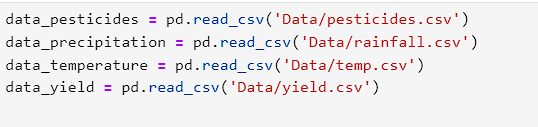
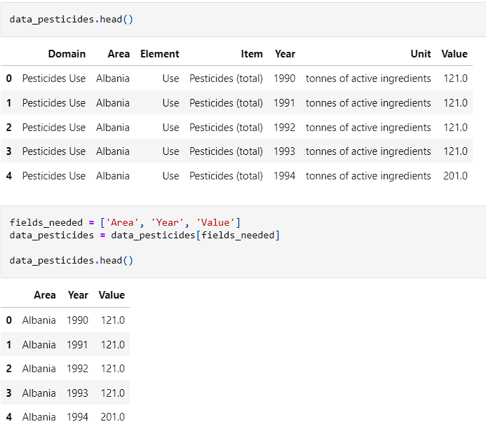
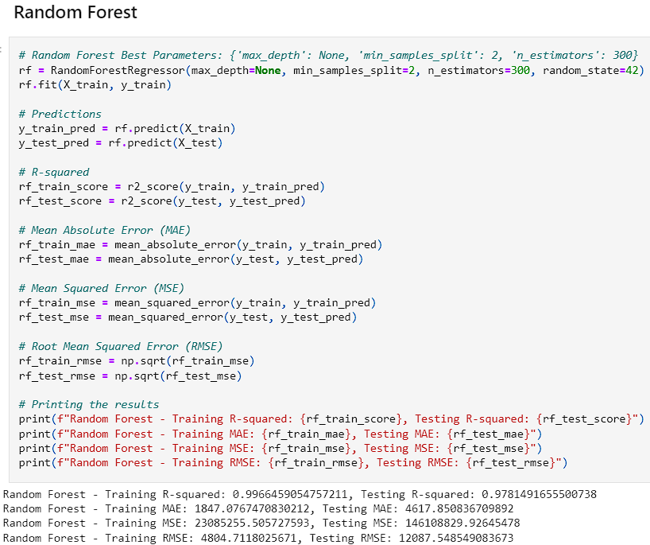
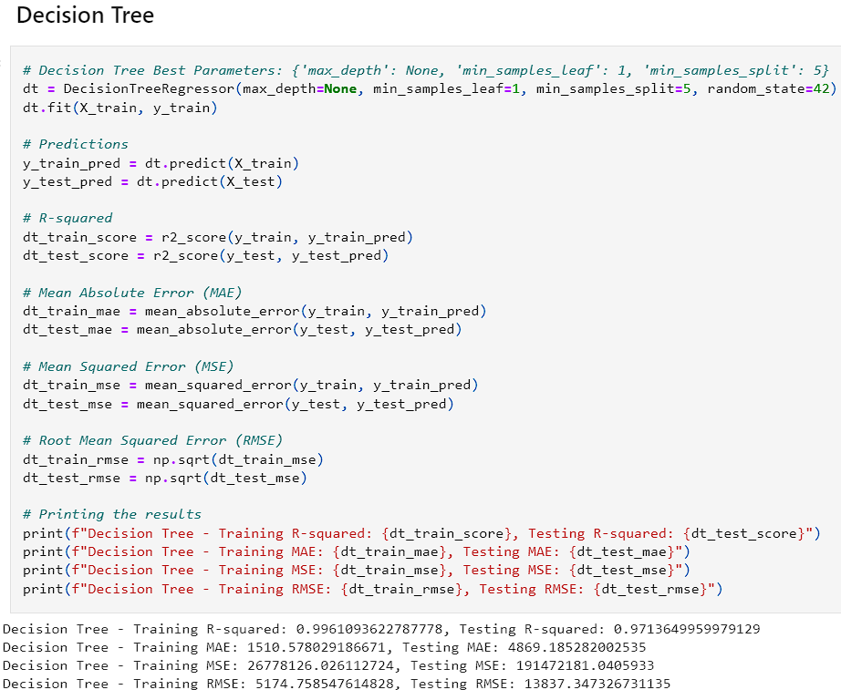
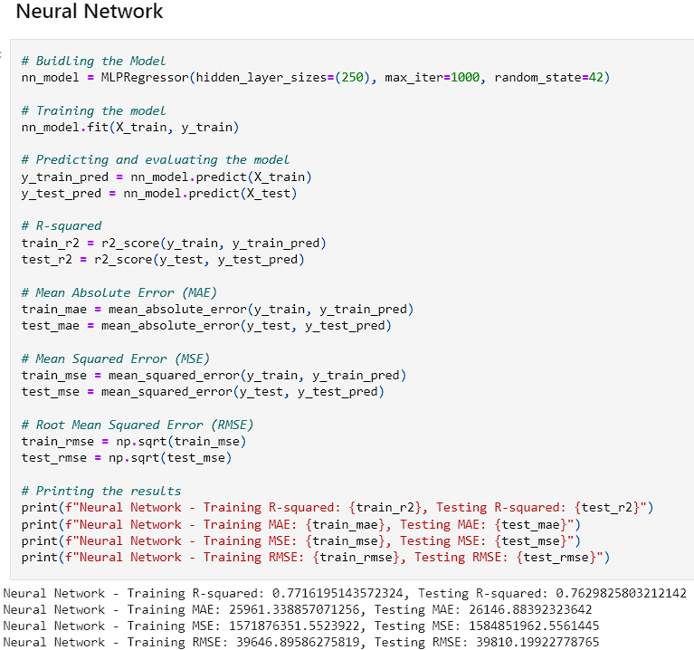
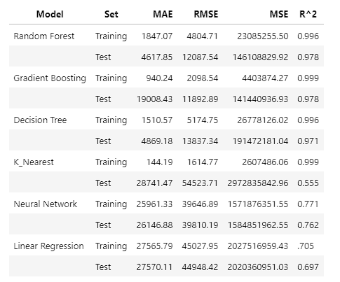

# Crop Yield Estimator
### [Jordan Wheeler](https://github.com/jordanwheeler7)
### Data Analytics Capstone Project 80/81FA23

## Project Goal
The goal of this project is to build a model that can determine the maximum crop yield that can be obtained given a set of parameters. This is a widely discussed topic within the Agriculture industry as improving crop yield reduces costs and helps provide sustanence for an ever growing population. This project focuses on trying to identify the best scenario to maximize crop yields while enabling a more sustainable form of Agriculture while reducing the environmental impacts. The full report can be read on [Overleaf](https://www.overleaf.com/read/kshnchhyhycm#1a66e0).

## Introduction
This project followed a standardized approach to a Data Science topic as shown in the image below. It began by defining the scenario that the research would take place on. Once completed, data collection and preparation took place. After cleaning the data, it was then extracted, transformed, and loaded into a Jupyter Notebook file. From there, an exploratory analysis took place to tell what was happening with the data and get a better understanding of what we were working with. Once an understanding was had, model building and testing took place. The goal of this area was to find a model that would give accurate results and did not under or over fit the data. The models and their uses were explained and insights from the models were explored. Finally, the project looked at limitations with the models and future uses. For a more in depth review on these, please visit the [Overleaf](https://www.overleaf.com/read/kshnchhyhycm#1a66e0) report.

## Files Used
* [pesticides](Data/pesticides.csv): Contains the information about pesticide usage in tonnes for each country per year.
* [rainfall](Data/rainfall.csv): Provides the average amount of rainfall in each country in mm per year.
* [temp](Data/temp.csv): Provides the average tempearture for each country in degrees Celsius.
* [yield](Data/yield.csv): Provides the yield for each country by crop and year. Results are measured in hectagrams per hectare.
* [df_yield](Data/df_yield.csv): This file is the combined data from all the other datasets with only relevant fields.

* The data for pesticides and yield were collected from the [FAO](https://www.fao.org/home/en/) website.
* The data for rainfall and temperature were collected from the [World Bank](https://data.worldbank.org/) website.

## Getting Started

* Begin by creating a folder to house your information.
* This folder should contain all data that was found and will eventually be where you store the notebook.
* For organizational purposes, all data has been stored in the Data folder.
* After getting the data and performing cleaning operations, create a virtual environment within your repository.
* Type `python -m venv .venv` in your terminal to setup a virtual environment.
* To activate the virtual environment type `.venv\Scripts\activate` in the terminal.
* After creating the virtual environment use `pip install -r requirements.txt` in the terminal.
* Once there, type `jupyter lab` in the terminal. If a browser does not automatically pop up, use `CTRL + Click` on the link provided.

## Requirements
1. Git
2. Python 3.7+ (3.11+ preferred)
3. VS Code Editor
4. VS Code Extension: Python (by Microsoft)

## Data Loading
* After initial setup, the data was loaded into the notebook using the pandas module for Python.

* Each of the datasets were then explored to see what fields we would need to add from them. The first dataset was yield. We examined it and created the function, fields_needed.

* Temperature was then examined and the columns were renamed to match the yield dataset.

* Precipitation was looked at and all fields were applicable so there was no adjustments that had to be made.

* Pesticides was the last set to be looked at. Columns had to be dropped as all of the element, unit, and item were the same for all fields.

* With all columns matching, the data was ready to be merged into on dataframe for ease of use.

* The data was then written a new CSV file and inspected to ensure that it was appearing how it was intended to look.

## Exploratory Data Analysis (EDA)
* The first step in the EDA was to examine the numerical and categorical features.
  
  
* The data was then looked at through the lens of histograms. The year feature was multimodal indicating that we have more records in some years than we do in others. Yield and pesticide usage were skewed left suggesting that higher yields and pesticide usage were a more rare occurrence. Both did have a slight tail to the right indicating that there is outlier data points. Finally, the temperature histogram showed that it was skewed right indicating that warmer temperatures occur more frequently in the data.
* After viewing the data, in order to prevent outlier data points, any country that contained less than 100 records was removed.
  
* After preforming this step, the data was dropped from 28248 down to 26297 records.
* The next step was to begin using visualizations to understand the data better. A copy of the data was created so that a correlation matrix could be used. From the matrix, a few weak negative correlations were discovered. There was nothing discovered in the data though that would suggest a linear relationship.
  
* After seeing the correlation matrix, another set of histograms was created to see if the skews had changed since removing countries with less than 100 records.
  
* At the same time, scatter plots were created to see how each crop faired against temperature, pesticides, and precipitation.
  
* From the images we have obtained, we can see that for our average yield, we have a right tail indicating that high yields are less common than average yields. The average precipitation seems to have a fairly normal skew while pesticides values tend to be on the lower end. Looking at the scatter plots, we see variability between all of our crops and yields. Average temperature shows that some crops have a wider variability such as wheat and rice whereas cassava and sweet potatoes are more clustered. This indicates that temperature ranges are variable depending on the crop but no significant linear relationship exists. Pesticide usuage shows that most of our yield comes from lower pesticide usage. Finally, with precipitation we still do not have a distinct linear relationship. It is noted that on precipitation, we have a larger cluster towarsd the bottom. This can indicate that crops have a threshold of precipitation when it comes to determining the yield.
* Pairplots were created to try and help get a better sense of where the data was at. The first group of charts shows the year, yield, and average temperature with crop distribution overlaid. We can see that the values are bimodal indicating different peaks in the various crops. When observing, Year vs Yield, we can see a more concentrated level of data in the late 2000's meaning that we crop yields are either getting better or we have more data. Due to there being a non discernible upward or downward trend, the inference is that we have more data. Average temperature seems to be remaining near the same across the years whereas pesticide usage has increased. When comparing yield to environmental factors, we again do not see a strong correlation between temperatures and crop yield. As shown in the correlation matrix, high pesticide usage does not show a clear indication of higher yield. One interesting point is when looking at the variance in soybeans and sweet potatoes suggesting they are more susceptible to environmental factors
  
* It was at this point, that it was needed to see what the yield distribution looked like by crops. A boxplot was created that offered some interesting insights. It waas seen that potatoes, cassava, and sweet potatoes had the most variance whereas sorghum, wheat, and soybeans had the least variability. Yams and cassava were the only two crops that did not have outlier data.
  
* To provide a more clear image, the different countries were split up into 5 groups. Each of these groups were then plotted to show the yield by average precipitation and yield by pesticide useage. The logic for this step was to see if there was a theme with precipitation and to see if pesticide use really increased the crop yield. There was not a clear relationship between a higher yield and either lower or higher precipitation. It is inferred that this has to do with countries producing the crops that fit best for that region. Again, a clear connection to higher pesticide use and higher yields was not present.
  
  
  
  
  
  
* While the breakdown by groups suggested that pesticide use did not always provide higher yields, two plots were created. The first was each crops yield and pesticide use. Logarithmic scaling was completed on this to get a clear image. The second plot, showed the total yield for each crop and the total pesticides used on an interactive scatter plot. Overall, most of the data is shown to be on the lower end of the pesticide use. There are some outlier features however, the highest yielding crops sit on the lower end of the scale for pesticide use.
  
  
* The final EDA visualization created was the range of temperatures each crop yield was collected in. This range of temperatures showed those that are less susceptible to environmental factors and those that might be more sensitive.
  
* The key insights gained in this part of the project suggests that there is not a linear relationship between the features in the data. The data all falls within a normal distribution indicating that no further transformation was needed. The outliers in the data were left in as they all fall within a normal range. The importance of the EDA helped decide the direction that was taken in the model building process.

## Model Building
* The model building process utilized 5 different machine learning models. Each model had the data split into a training and testing set on an 80/20 split. To ensure that optimal parameters were present, GridSearchCV was ran for each model. Parameters were munipulated to ensure that all models were given a fair chance.
* While a linear regression model was assumed to be a bad fit, the model was still ran to see its performance. Surprisingly, while the data did not suggest a linear relationship, the linear regression model fit put it right in the middle of the pact.
* After viewing the linear regression, the data was prepared and split. This step involved first defining our features whether categorical or numerical. Then encoding categorical features with OneHotEncoder. The data was then split with `X_transformed = preprocessor.fit_transform(X)` followed by `X_train, X_test, y_train, y_test = train_test_split(X_transformed, y, test_size=0.2, random_state=42)`.
* The first model ran was the RandomForestRegressor followed by Gradient Boost, Decision Tree, K-Nearest Neighbors, and finally a Neural Network.
  * 
  * 
  * 
  * 
  * 
* Each of these models were ran and the Mean Squared Error, Root Mean Squared Error, Mean Average Error, and R^2 values were accounted for. The goal was to have a model with a higher R^2 value for the training and test sets while not over or underfitting the data. After running the models initially, the Random Forest and Decision Tree both contained high R^2 values. The decision tree was slightly higher and had a lower MSE, RMSE, and MAE on the test sets. However, the training sets for those values were way higher suggesting that it was overfitting the data. The Random Forest also had a significant drop in effectiveness between the training and test sets with the MAE, RMSE, and MSE. 
* To ensure that the models were trained as good as possible, Grid Search CV was ran so that we could find the optimal parameters.
  
* After adjusting the parameters and finding the optimal solution, we received the results in the image below.
  * 
  * 
* After reviewing the results, Random Forest and Gradient Boost seemed to perform the best on the data regarding generalization and high accuracy. The Decision Tree and KNN models seemed to overfit the data while the Neural Network underperformed. This could be due to a lack of complexity within the data. The linear regression model provides a good baseline as it provides consistent predictions although they are less accurate.

## Model Assessment
* After choosing the Gradient Boost model, it was explored to see visualizations on the performance.
* 
* 
* The models show the importance of features. The second graph shows the permutation features. Permutation features are different than normal as they change the values and update the importance based on those that impact the model the most. The first chart shows that Crops, Climactic Features, and Region play a significant role. However, the second shows that crops and region are the 2 biggest factors.

* 
* 
* The CV and Learning Curve both share a common feature in the cross-validation feature. On the learning curve, the closer the curve gets to the cross-validation line, the better the model. The visualization aims to tell the users whether the model does better with small or large amounts of training data. The curve gets closer to the CV with more data suggesting it performs better when it has more data fed to it.

* 
* 

* The final tests were ran using 2 different kinds of scatter plots. The first plots actual versus predicted values on a diaganol axis. The closer to the diagonal, the better the performance is. The second is similar except it plots a residual plot on a horizontal axis. The closer to the horizontal the better the model is  performing. Both models show that the model does well on the lower values but, it shows that as the values increase, the model performs worse. Both visuals also show that the models are overfitting slightly on the larger values.

## Conclusions
 * This project utilized 6 different regression methods to attempt to predict the yield for 10 different crops using information on crop yield, pesticide use, average precipitation, average temperature, and crop type. The Gradient Boost method was chosen for the higher recall on unseen data and that it generalized the information between training and test sets better than all other models used. The model was tuned to provide the best possible results which led to an impressive 99.9% accuracy rating on the training set and a 97.8% accuracy on the test set. Furthermore, the model showed the lowest variance in the Mean Absolute Error, Mean Squared Error, and Root Mean Squared Error, showing the ability to generalize the data better than all other models used. Given the same information that this model was trained on, it would be suitable to provide a prediction on the yield you could expect from each crop.

## References
1. [Databank, T.W.: Climate change overview: Country summary](https://www.fao.org/faostat/en/data) (2023), accessed on October 20, 2023
2. [Food, of the United Nations, A.O.: Faostat](https://www.fao.org/faostat/en/) (2023), accessed on October 20, 2023
3. [Geopard: Predicting crop yield with remote sensing data](https://geopard.tech/blog/predicting-crop-yield-with-remote-sensing-data/) (2023), accessed: 2023-11-21
4. [Jupyter, P.: Project Jupyter: Open source software for interactive computing](https://jupyter.org/) (2023), accessed: 2023-11-02
5. [OECD: Crop Production](https://data.oecd.org/agroutput/crop-production.html) (2023), accessed on October 25, 2023
6. [Ritchie, H., Rosado, P., Roser, M.: Crop yields. Our World in Data](https://ourworldindata.org/crop-yields) (2022), accessed on October 20, 2023
7. [pandas development team, T.: pandas: Powerful data structures for data analysis](https://pandas.pydata.org/) (2023), accessed: 2023-11-02
8. [USDA: Food security status of U.S. households in 2022](https://www.sers.usda.gov/topics/food-nutrition-assistance/food-security-in-the-u-s/key-statitics-graphics/#:∼:text=89.8%20percent%20(118.5%20million)%20of,from%289.5%20percent%20in%202020) (2023), accessed on October 25, 2023
